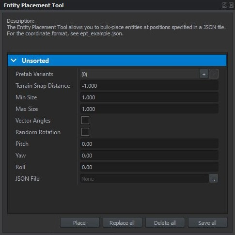

# entity-placement-plugin
The Entity Placement Plugin is a tool for Enfusion / ArmA Reforger Tools that allows you to bulk-place entities at specified positions.

It does this by loading coordinates and orientations from a given JSON file - for the correct format, see ept_example.json. It also supports rotation & scale randomization, and includes a terrain snapping feature.

Note: While this public version generally works, it does have a couple of small issues and missing features (Relative Y Support, Normal Snapping, Y Offset). As my personal version is heavily customized, I cannot simply push said improvements without additional work. That said, if anyone needs them, please let me know and I will update the public version.
